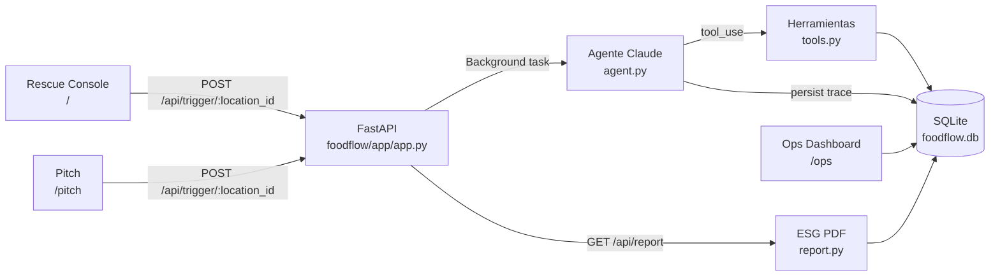
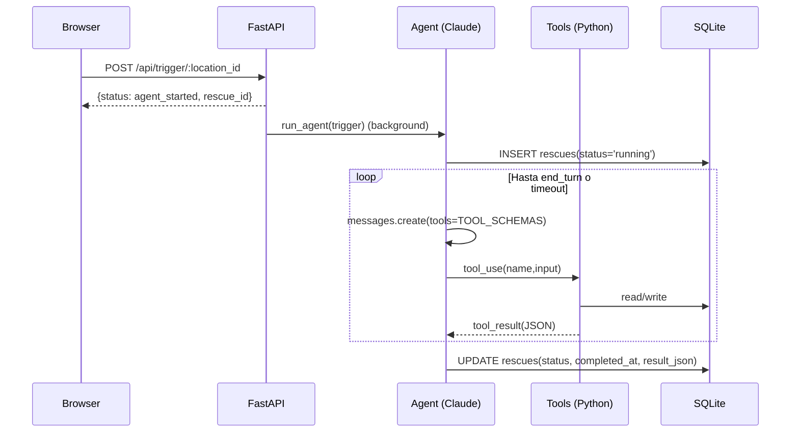
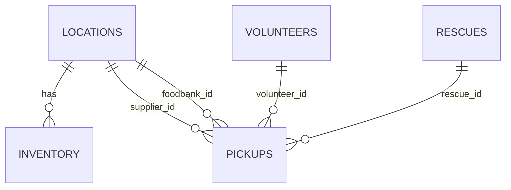

# 🌿 FoodFlow AI

**FoodFlow AI** es un MVP (hackathon) de un **agente autónomo de rescate de alimentos** que detecta excedentes, encuentra capacidad en un banco de alimentos, selecciona un voluntario, calcula la ruta/ETA, verifica cobertura legal bajo el **Bill Emerson Good Samaritan Food Donation Act**, y despacha un pickup (SMS “mock”) — **sin intervención humana**.

Todo el proceso queda con **trazabilidad completa** en SQLite (`foodflow.db`) mediante un **trace por rescate** guardado en `rescues.result_json`, y el sistema genera un **reporte ESG en PDF** con métricas e historial de cumplimiento.

Construido para el **Cornell Claude Builders Club Hackathon 2026** (tema: Social Impact).

---

## Qué es (idea / producto)

- **Qué hace**: coordina “en minutos” el rescate del excedente que hoy se pierde por falta de coordinación (llamadas, planillas, nadie disponible tarde).
- **Cómo lo hace**: ejecuta un loop fijo de **6 herramientas** (Claude `tool_use`) con límites duros de tiempo/iteraciones para terminar rápido (por defecto **45s** y **12 iteraciones**).
- **Qué entrega**:
  - Un pickup registrado (tabla `pickups`)
  - Un trace auditable (tabla `rescues`, campo `result_json`)
  - Métricas de impacto (lbs rescatadas, “meals”, CO₂ evitado) y **PDF ESG**

## Qué problema resuelve (por qué importa)

En EE.UU. se desperdicia una fracción enorme de lo producido mientras hay inseguridad alimentaria. El cuello de botella práctico no es “la comida”, sino la **coordinación de último kilómetro**: cuándo hay excedente, quién puede recibirlo, quién lo retira, si hay cobertura legal, y dejar registro.

FoodFlow apunta a eliminar ese cuello de botella con automatización total y trazabilidad.

## Cómo hace dinero (modelo)

SaaS B2B para instituciones (universidades, hoteles, hospitales):

- **Pricing objetivo**: \( \$500\text{–}\$2{,}000/mes \) por institución / sitio.
- **Valor adicional**: el **reporte ESG** automatizado (auditable) reduce costo de reporting.

### “Gráfico” rápido (ARR potencial por campus, ejemplo conceptual)

```mermaid
xychart-beta
  title "Ejemplo conceptual: ARR por campus (rangos)"
  x-axis ["10 sitios","25 sitios","46 sitios"]
  y-axis "ARR (USD)" 0 --> 1200000
  bar ["$500/mes"] [60000,150000,276000]
  bar ["$2,000/mes"] [240000,600000,1104000]
```

> Nota: esto es un gráfico conceptual de pricing. El repo implementa el MVP técnico (loop + DB + UI + PDF), no el billing.

---

## Qué puedes hacer (UI)

- **Rescue Console**: `http://127.0.0.1:8000/`
  - Disparar un rescate desde un surplus activo.
  - Ver el último rescate (status + trace + mensajes del agente).
- **Ops Dashboard**: `http://127.0.0.1:8000/ops`
  - Inspeccionar todo lo guardado: rescues, pickups, inventory, volunteers.
- **Pitch deck (interactivo)**: `http://127.0.0.1:8000/pitch`
  - Slides que leen métricas en vivo desde SQLite.
- **ESG PDF**: `http://127.0.0.1:8000/api/report`
- **API docs (OpenAPI)**: `http://127.0.0.1:8000/docs`

---

## Quick start (2–3 minutos)

### 1) Instalar dependencias

```bash
python -m venv .venv
source .venv/bin/activate
pip install -r requirements.txt
```

### 2) Configurar credenciales y modo demo

Crea un `.env` en la raíz (misma carpeta que `main.py`):

```env
ANTHROPIC_API_KEY=sk-ant-...
```

Opcional (recomendado para demos públicas):

```env
FOODFLOW_DEMO_TOKEN=demo123
FOODFLOW_ANTHROPIC_MODEL=claude-sonnet-4-6
FOODFLOW_AGENT_MAX_SECONDS=45
FOODFLOW_AGENT_MAX_ITERS=12
FOODFLOW_MAX_COMPLETION_TOKENS=4096
```

### 3) Correr el servidor

```bash
uvicorn main:app --reload --port 8000
```

Abre `http://127.0.0.1:8000/`.

---

## Demo en 60 segundos (guion)

1) Abre `http://127.0.0.1:8000/`
2) Click en **Trigger AI Rescue**
3) Abre `http://127.0.0.1:8000/ops` y entra al `rescue_id` nuevo
4) Descarga el ESG PDF en `http://127.0.0.1:8000/api/report`

---

## Cómo funciona (visión técnica precisa)

### Arquitectura (alto nivel)



### El loop autónomo de 6 herramientas (Claude `tool_use`)

El agente está “forzado” por prompt a seguir **exactamente este orden** (`agent.py`):

1. **`check_inventory`**: confirma excedente (lee de `inventory` vía `get_surplus_items()`)
2. **`check_foodbank_capacity`**: valida que el banco acepte (lee de `locations`, tipo `foodbank`)
3. **`query_volunteers`**: selecciona voluntarios cercanos y disponibles (`volunteers.available=1`)
4. **`calculate_route`**: estima distancia y ETA (demo: **haversine** + velocidad fija)
5. **`verify_compliance`**: verifica cobertura bajo Bill Emerson Act (demo: retorna `compliant=True`)
6. **`dispatch_pickup`**: registra pickup en SQLite + genera texto SMS (demo: imprime a consola)

Cada output de herramienta se apila en `result["steps"]` y se guarda como JSON en `rescues.result_json`.

### Diagrama de secuencia (click en “Trigger AI Rescue”)



---

## Base de datos (SQLite) y trazabilidad

- **Archivo**: `foodflow.db`
- **Tablas principales**:
  - `locations`: proveedores (`type='supplier'`) y foodbanks (`type='foodbank'`, con `capacity_lbs`)
  - `inventory`: items con `predicted_surplus` para simular excedentes
  - `volunteers`: roster de voluntarios con `available` (1/0)
  - `rescues`: una corrida del agente por `rescue_id` + `status` + `result_json` (trace completo)
  - `pickups`: despachos realizados (y vínculo a `rescue_id`)

### Modelo lógico (ER)



### Métricas de impacto (cómo se calculan en este repo)

El endpoint/UI usa `database.get_stats()` y calcula:

- **lbs rescatadas**: suma de `pickups.quantity_lbs`
- **meals**: `lbs * 0.817`
- **CO₂ evitado (kg)**: `lbs * 1.134`

> Estas constantes son “demo defaults” del MVP (sirven para mostrar impacto en vivo).

---

## Reporte ESG (PDF) — qué incluye

El PDF se genera con `reportlab` (`report.py`) y construye:

- Portada “brand”
- KPIs (pickups, lbs, meals, CO₂)
- Rescue log y dispatched pickups (tablas)
- **Compliance log**: extraído desde `rescues.result_json` buscando pasos `verify_compliance`

Ruta: `GET /api/report`.

---

## API (integración)

- **`POST /api/trigger/{location_id}`**: inicia rescate en background
- **`GET /api/rescues/{rescue_id}`**: estado y trace persistido
- **`GET /api/stats`**: KPIs (para dashboard/pitch)
- **`GET /api/surplus`**: excedentes simulados
- **`GET /api/report`**: PDF ESG
- **`GET /health`**: healthcheck + si Anthropic está configurado
- **`POST /api/admin/reset`**: resetea estado runtime del demo (borra `rescues` y `pickups`, vuelve voluntarios a `available=1`)
- **`POST /api/admin/volunteers/reset`**: marca todos los voluntarios como disponibles

### Autorización “demo token” (opcional)

Si defines `FOODFLOW_DEMO_TOKEN`, los endpoints sensibles requieren:

- header `x-demo-token: <token>` **o**
- query `?token=<token>`

---

## Configuración (variables de entorno)

- **`ANTHROPIC_API_KEY`**: requerido para correr el agente real.
- **`FOODFLOW_ANTHROPIC_MODEL`**: modelo (default `claude-sonnet-4-6`).
- **`FOODFLOW_AGENT_MAX_SECONDS`**: timeout del loop (default `45`).
- **`FOODFLOW_AGENT_MAX_ITERS`**: iteraciones máximas (default `12`).
- **`FOODFLOW_MAX_COMPLETION_TOKENS`**: tokens por completion (default `4096` en `agent.py`).
- **`FOODFLOW_DEMO_TOKEN`**: activa auth básica para demo.

---

## Layout del repo

```
main.py                 entrypoint (expone FastAPI app)
foodflow/app/app.py     rutas FastAPI + templates + background tasks
foodflow/core/settings.py  carga .env + defaults
agent.py                loop Claude tool_use + persistencia de trace
tools.py                6 herramientas + schemas para Claude
database.py             SQLite schema/seed + helpers (queries/metrics)
report.py               generador ESG PDF (reportlab)
templates/              Jinja UI (/, /ops, /pitch)
static/                 CSS
```

---

## Limitaciones del MVP (importante si lo presentas como “autónomo”)

- **SMS**: `dispatch_pickup` no integra Twilio; genera el texto y lo imprime (mock).
- **Rutas/ETA**: `calculate_route` usa haversine + velocidad fija (no Google Maps).
- **Compliance**: `verify_compliance` es demo y retorna `compliant=True` (el PDF registra el check, no auditoría real).
- **Inventario**: `inventory.predicted_surplus` está seed-eado (no POS/IoT).

---

## Troubleshooting

### “Missing ANTHROPIC_API_KEY”
- Falta `ANTHROPIC_API_KEY` en `.env` (o en el entorno).

### “Unauthorized” al disparar el agente
- `FOODFLOW_DEMO_TOKEN` está activo y no estás enviando `x-demo-token` o `?token=...`.

### Rescates en `running` para siempre
- Hay un cleanup automático que marca rescates viejos como `timeout` (ver `cleanup_stale_running_rescues()`).
- Si ocurre seguido: key inválida, rate-limit o falla de red hacia el LLM.

### No hay voluntarios
- Si todos quedaron `available=0`, resetea desde `/api/admin/volunteers/reset` (requiere token si está activo) o desde `/ops`.

---

## Hecho en hackathon

FoodFlow AI · Cornell Claude Builders Club Hackathon · April 25, 2026  
Powered by [Anthropic Claude](https://anthropic.com) · FastAPI · SQLite · reportlab
