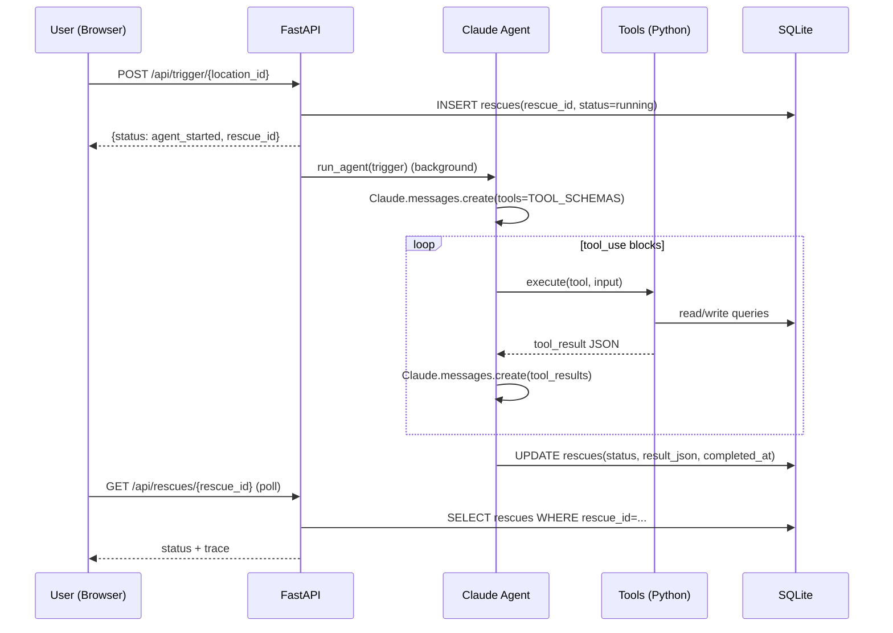
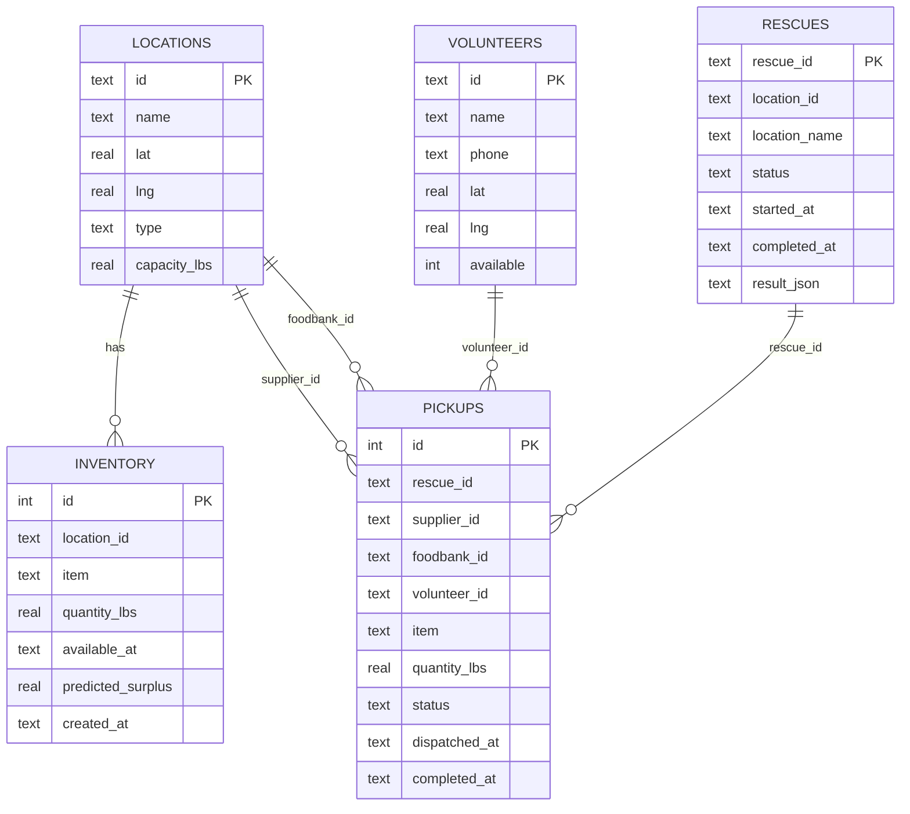

# 🌿 FoodFlow AI

**FoodFlow AI** is a hackathon MVP that runs an **autonomous food rescue loop**: detect surplus food, select a food bank, find a driver, estimate route/ETA, verify compliance, and dispatch a pickup — then **logs everything** to SQLite and generates an **ESG impact PDF**.

Built for the **Cornell Claude Builders Club Hackathon 2026** (Theme: Social Impact).

---

## What you can do (UI)

- **Rescue Console**: `http://127.0.0.1:8000/`
  - Trigger an AI rescue from any active surplus alert.
  - See the latest rescue status + what Claude decided + tool trace.
- **Ops Dashboard**: `http://127.0.0.1:8000/ops`
  - Inspect everything stored in the database: rescues, pickups, inventory, volunteers.
- **Pitch deck (interactive)**: `http://127.0.0.1:8000/pitch`
  - Slide deck UI that pulls **live metrics** from SQLite.
- **ESG PDF**: `http://127.0.0.1:8000/api/report`
- **API docs**: `http://127.0.0.1:8000/docs`

---

## Quick start (2 minutes)

### 1) Install

```bash
python -m venv .venv
source .venv/bin/activate
pip install -r requirements.txt
```

### 2) Configure Claude (Anthropic)

Create a `.env` file in the repo root (same folder as `main.py`):

```env
ANTHROPIC_API_KEY=sk-ant-...
```

Optional (recommended for demos):

```env
FOODFLOW_DEMO_TOKEN=demo123
FOODFLOW_ANTHROPIC_MODEL=claude-sonnet-4-6
```

### 3) Run the server

```bash
uvicorn main:app --reload --port 8000
```

Open:
- `http://127.0.0.1:8000/`

---

## Demo script (what to do in 60 seconds)

1) Open `http://127.0.0.1:8000/` (**Rescue Console**)
2) Click **Trigger AI Rescue** on a surplus alert
3) Watch **Status** change and the **Claude summary** appear
4) Open `http://127.0.0.1:8000/ops` and click the new `rescue_id`
5) Download the ESG PDF from `http://127.0.0.1:8000/api/report`

---

## How it works (system overview)

### The 6-tool agent loop (Claude tool_use)

Claude orchestrates the rescue by calling these tools in order:

1. **`check_inventory`** → reads predicted surplus items for a location
2. **`check_foodbank_capacity`** → finds a food bank that can accept
3. **`query_volunteers`** → selects nearby available volunteer drivers
4. **`calculate_route`** → estimates distance + ETA (haversine demo)
5. **`verify_compliance`** → Bill Emerson Act compliance check (demo)
6. **`dispatch_pickup`** → logs pickup to DB + generates SMS text (demo)

Every tool call output is appended to a single **rescue trace** (`rescues.result_json`).

### Visual overview (high-level)

```mermaid
flowchart LR
  UI[Rescue Console<br/>/]
  OPS[Ops Dashboard<br/>/ops]
  PITCH[Interactive Pitch<br/>/pitch]
  API[FastAPI app<br/>main.py → foodflow/app/app.py]
  AGENT[Claude agent<br/>agent.py]
  TOOLS[Tools layer<br/>tools.py]
  DB[(SQLite<br/>foodflow.db)]
  PDF[ESG PDF<br/>/api/report]

  UI -->|POST /api/trigger/{location_id}| API
  PITCH -->|POST /api/trigger/{location_id}| API
  API -->|Background task| AGENT
  AGENT -->|tool_use calls| TOOLS
  TOOLS --> DB
  AGENT -->|write trace| DB
  OPS --> DB
  API --> PDF
  PDF --> DB
```

### Request flow (Trigger button)

1) Browser calls `POST /api/trigger/{location_id}`
2) Server creates a `rescue_id` and starts `run_agent(...)` in a background task
3) `agent.py` calls Claude with `TOOL_SCHEMAS`
4) Each tool executes in Python (`tools.py`), reading/writing SQLite (`database.py`)
5) Final result (including Claude messages) is stored and displayed in the UI

### Sequence diagram (what happens when you click “Trigger AI Rescue”)



---

## Database (SQLite)

Database file: `foodflow.db`

Main tables:
- **`locations`**: suppliers + food banks
- **`inventory`**: surplus items (seeded demo data)
- **`volunteers`**: driver roster + availability
- **`rescues`**: each agent run (`rescue_id`, status, timestamps, `result_json`)
- **`pickups`**: dispatched pickups (linked to `rescue_id`)

Where to inspect:
- UI: `http://127.0.0.1:8000/ops`

### Database schema (logical view)



---

## API endpoints (useful for integration)

- **`POST /api/trigger/{location_id}`**: start a rescue (background)
- **`GET /api/rescues/{rescue_id}`**: fetch a rescue record (status + trace)
- **`GET /api/stats`**: metrics used by dashboard + pitch
- **`GET /api/surplus`**: predicted surplus alerts
- **`GET /api/report`**: ESG PDF
- **`GET /health`**: health check

### Demo token (optional)

If you set `FOODFLOW_DEMO_TOKEN`, then protected endpoints require:
- header: `x-demo-token: <token>`
or
- query param: `?token=<token>`

---

## Repo layout

```
main.py                 entrypoint (exports FastAPI app)
foodflow/app/app.py     FastAPI routes + templates wiring
agent.py                Claude tool_use loop + trace persistence
tools.py                tool functions + tool schemas
database.py             SQLite schema/seed + read/write helpers
report.py               ESG PDF generator (reportlab)
templates/              Jinja UI (/, /ops, /pitch)
static/                 CSS
```

---

## Troubleshooting

### “Unauthorized” when clicking Trigger
- You likely enabled `FOODFLOW_DEMO_TOKEN`. Make sure the UI is served by the same server instance (it injects the token automatically).

### Rescue gets stuck in “running”
- The server marks stale rescues as `timeout` automatically.
- If it happens repeatedly, your `ANTHROPIC_API_KEY` may be missing/invalid or you hit a rate limit.

### No volunteer drivers available
- If all volunteers are marked busy in SQLite, the rescue can block at `query_volunteers`.
  - Check `http://127.0.0.1:8000/ops` → Volunteers.

---

## Built at hackathon

FoodFlow AI · Cornell Claude Builders Club Hackathon · April 25, 2026  
Powered by [Anthropic Claude](https://anthropic.com) · FastAPI · SQLite · reportlab
