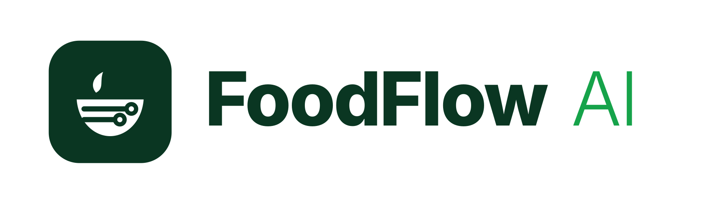
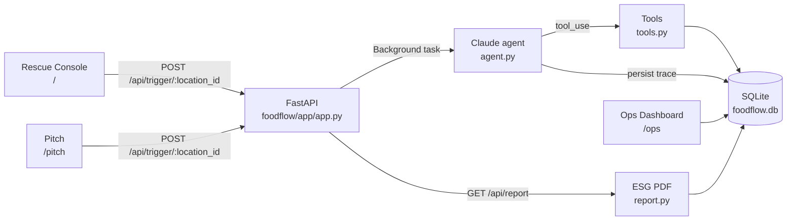
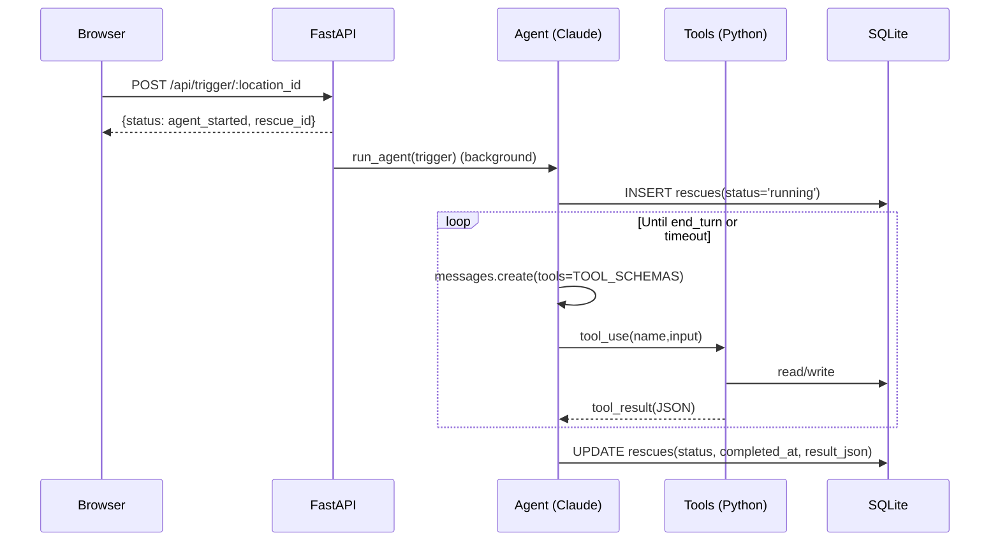
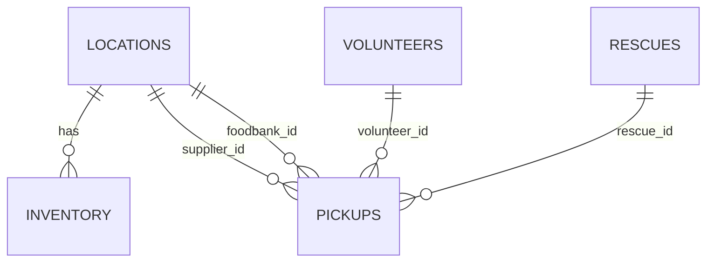

<p align="center"></p>

<p align="center">
  
  
  
  
  
</p>

# FoodFlow AI

**FoodFlow AI** is a hackathon MVP of an **autonomous food-rescue agent**. It detects surplus food, finds capacity at a food bank, picks a volunteer, estimates route and ETA, checks liability coverage under the **Bill Emerson Good Samaritan Food Donation Act**, and dispatches a pickup (mock SMS) — **with no human in the loop**.

Every run is fully traceable in SQLite (`foodflow.db`) through a **per-rescue trace** stored in `rescues.result_json`, and the system generates an **ESG PDF report** with impact metrics and a compliance log.

Built at the **Cornell Claude Builders Club Hackathon 2026** (track: Social Impact).

---

## What it is

- **What it does**: coordinates, in minutes, the rescue of surplus food that is usually lost to poor coordination (phone calls, spreadsheets, nobody available late in the day).
- **How**: runs a fixed loop of **6 tools** (Claude `tool_use`) with hard time and iteration limits so it finishes fast (defaults: **45 s** and **12 iterations**).
- **What it produces**:
  - A recorded pickup (`pickups` table)
  - An auditable trace (`rescues` table, `result_json` field)
  - Impact metrics (lbs rescued, meals, CO₂ avoided) and an **ESG PDF**

## Why it matters

The US wastes a huge share of the food it produces while food insecurity persists. The practical bottleneck is not the food itself but **last-mile coordination**: knowing when there is surplus, who can take it, who picks it up, whether it is legally covered, and keeping a record.

FoodFlow targets that bottleneck with end-to-end automation and a full audit trail.

## Business model

B2B SaaS for institutions (universities, hotels, hospitals):

- **Target pricing**: $500–$2,000 per month per institution or site.
- **Added value**: the automated, auditable **ESG report** cuts reporting costs.

### Illustrative ARR per campus


```mermaid
xychart-beta
  title "Illustrative ARR per campus (ranges)"
  x-axis ["10 sites","25 sites","46 sites"]
  y-axis "ARR (USD)" 0 --> 1200000
  bar "$500/mo" [60000,150000,276000]
  bar "$2,000/mo" [240000,600000,1104000]
```

> Note: this is an illustrative pricing chart. The repo implements the technical MVP (agent loop + DB + UI + PDF), not billing.

---

## What you can do (UI)

- **Rescue Console**: `http://127.0.0.1:8000/`
  - Trigger a rescue from an active surplus.
  - See the latest rescue (status, trace and agent messages).
- **Ops Dashboard**: `http://127.0.0.1:8000/ops`
  - Inspect everything stored: rescues, pickups, inventory, volunteers.
- **Interactive pitch deck**: `http://127.0.0.1:8000/pitch`
  - Slides that read live metrics from SQLite.
- **ESG PDF**: `http://127.0.0.1:8000/api/report`
- **API docs (OpenAPI)**: `http://127.0.0.1:8000/docs`

---

## Quick start (2–3 minutes)

### 1) Install dependencies

```bash
python -m venv .venv
source .venv/bin/activate
pip install -r requirements.txt
```

### 2) Configure credentials and demo mode

Create a `.env` file in the repo root (next to `main.py`), or copy `.env.example`:

```env
ANTHROPIC_API_KEY=sk-ant-...
```

Optional (recommended for public demos):

```env
FOODFLOW_DEMO_TOKEN=demo123
FOODFLOW_ANTHROPIC_MODEL=claude-sonnet-4-6
FOODFLOW_AGENT_MAX_SECONDS=45
FOODFLOW_AGENT_MAX_ITERS=12
FOODFLOW_MAX_COMPLETION_TOKENS=4096
```

### 3) Run the server

```bash
uvicorn main:app --reload --port 8000
```

Open `http://127.0.0.1:8000/`.

---

## 60-second demo script

1. Open `http://127.0.0.1:8000/`
2. Click **Trigger AI Rescue**
3. Open `http://127.0.0.1:8000/ops` and select the new `rescue_id`
4. Download the ESG PDF from `http://127.0.0.1:8000/api/report`

---

## How it works

### Architecture


```mermaid
flowchart LR
  UI["Rescue Console\n/"]
  OPS["Ops Dashboard\n/ops"]
  PITCH["Pitch\n/pitch"]
  API["FastAPI\nfoodflow/app/app.py"]
  AGENT["Claude agent\nagent.py"]
  TOOLS["Tools\ntools.py"]
  DB[("SQLite\nfoodflow.db")]
  PDF["ESG PDF\nreport.py"]

  UI -->|"POST /api/trigger/:location_id"| API
  PITCH -->|"POST /api/trigger/:location_id"| API
  API -->|Background task| AGENT
  AGENT -->|tool_use| TOOLS
  TOOLS --> DB
  AGENT -->|persist trace| DB
  OPS --> DB
  API -->|GET /api/report| PDF
  PDF --> DB
```

### The 6-tool autonomous loop (Claude `tool_use`)

The prompt in `agent.py` forces the agent to follow **exactly this order**:

1. **`check_inventory`** — confirms surplus (reads `inventory` via `get_surplus_items()`)
2. **`check_foodbank_capacity`** — checks the food bank can accept it (reads `locations`, type `foodbank`)
3. **`query_volunteers`** — picks nearby available volunteers (`volunteers.available=1`)
4. **`calculate_route`** — estimates distance and ETA (demo: **haversine** + fixed speed)
5. **`verify_compliance`** — checks Bill Emerson Act coverage (demo: returns `compliant=True`)
6. **`dispatch_pickup`** — records the pickup in SQLite and builds the SMS text (demo: printed to the console)

Each tool output is appended to `result["steps"]` and saved as JSON in `rescues.result_json`.

### Sequence ("Trigger AI Rescue")


```mermaid
sequenceDiagram
  participant Browser as Browser
  participant API as FastAPI
  participant Agent as Agent (Claude)
  participant Tools as Tools (Python)
  participant DB as SQLite

  Browser->>API: POST /api/trigger/:location_id
  API-->>Browser: {status: agent_started, rescue_id}
  API->>Agent: run_agent(trigger) (background)

  Agent->>DB: INSERT rescues(status='running')
  loop Until end_turn or timeout
    Agent->>Agent: messages.create(tools=TOOL_SCHEMAS)
    Agent->>Tools: tool_use(name,input)
    Tools->>DB: read/write
    Tools-->>Agent: tool_result(JSON)
  end
  Agent->>DB: UPDATE rescues(status, completed_at, result_json)
```

---

## Database (SQLite) and traceability

- **File**: `foodflow.db` (created and seeded on first run)
- **Main tables**:
  - `locations`: suppliers (`type='supplier'`) and food banks (`type='foodbank'`, with `capacity_lbs`)
  - `inventory`: items with `predicted_surplus` to simulate surplus
  - `volunteers`: volunteer roster with `available` (1/0)
  - `rescues`: one agent run per `rescue_id` + `status` + `result_json` (full trace)
  - `pickups`: dispatched pickups (linked to `rescue_id`)

### Logical model


```mermaid
erDiagram
  LOCATIONS ||--o{ INVENTORY : "has"
  LOCATIONS ||--o{ PICKUPS : "supplier_id"
  LOCATIONS ||--o{ PICKUPS : "foodbank_id"
  VOLUNTEERS ||--o{ PICKUPS : "volunteer_id"
  RESCUES ||--o{ PICKUPS : "rescue_id"
```

### Impact metrics

The endpoint and UI use `database.get_stats()`:

- **lbs rescued**: sum of `pickups.quantity_lbs`
- **meals**: `lbs * 0.817`
- **CO₂ avoided (kg)**: `lbs * 1.134`

> These constants are MVP demo defaults, used to show impact live.

---

## ESG report (PDF)

Generated with `reportlab` (`report.py`). It includes:

- Branded cover
- KPIs (pickups, lbs, meals, CO₂)
- Rescue log and dispatched pickups (tables)
- **Compliance log**: built from `rescues.result_json` by collecting the `verify_compliance` steps

Route: `GET /api/report`.

---

## API

- **`POST /api/trigger/{location_id}`** — start a rescue in the background
- **`GET /api/rescues/{rescue_id}`** — status and persisted trace
- **`GET /api/stats`** — KPIs (dashboard and pitch)
- **`GET /api/surplus`** — simulated surplus
- **`GET /api/report`** — ESG PDF
- **`GET /health`** — healthcheck, plus whether Anthropic is configured
- **`POST /api/admin/reset`** — reset demo runtime state (clears `rescues` and `pickups`, sets volunteers back to `available=1`)
- **`POST /api/admin/volunteers/reset`** — mark all volunteers available

### Demo token (optional)

If `FOODFLOW_DEMO_TOKEN` is set, sensitive endpoints require either:

- header `x-demo-token: <token>`, or
- query `?token=<token>`

---

## Configuration (environment variables)

- **`ANTHROPIC_API_KEY`** — required to run the real agent.
- **`FOODFLOW_ANTHROPIC_MODEL`** — model (default `claude-sonnet-4-6`).
- **`FOODFLOW_AGENT_MAX_SECONDS`** — loop timeout (default `45`).
- **`FOODFLOW_AGENT_MAX_ITERS`** — max iterations (default `12`).
- **`FOODFLOW_MAX_COMPLETION_TOKENS`** — tokens per completion (default `4096` in `agent.py`).
- **`FOODFLOW_DEMO_TOKEN`** — enables basic auth for demos.

---

## Repo layout

```
main.py                    entrypoint (exposes the FastAPI app)
foodflow/app/app.py        FastAPI routes + templates + background tasks
foodflow/core/settings.py  loads .env + defaults
agent.py                   Claude tool_use loop + trace persistence
tools.py                   the 6 tools + their schemas for Claude
database.py                SQLite schema/seed + query and metric helpers
report.py                  ESG PDF generator (reportlab)
templates/                 Jinja UI (/, /ops, /pitch)
static/                    CSS
brand/                     logos and icons (SVG/PNG)
pitch/                     static decks and website (self-contained HTML + PDF)
docs/                      MVP implementation plan
```

### Pitch materials (`pitch/`)

Self-contained HTML files; open them directly in a browser.

| File | Contents |
|---|---|
| `pitch-deck.html` | Main pitch deck (12 slides) |
| `premium-deck.html` / `.pdf` | Premium dark-theme deck |
| `deep-dive.html` / `.pdf` | Technical and business deep dive |
| `brand-deck.html` | Brand system |
| `interactive-demo.html` | Interactive walkthrough of the rescue flow |
| `website.html` | Marketing landing page |

---

## MVP limitations

Worth knowing before presenting it as "autonomous":

- **SMS**: `dispatch_pickup` does not integrate Twilio; it builds the text and prints it (mock).
- **Routes/ETA**: `calculate_route` uses haversine + fixed speed (no Google Maps).
- **Compliance**: `verify_compliance` is a demo stub that returns `compliant=True` (the PDF records the check; it is not a real audit).
- **Inventory**: `inventory.predicted_surplus` is seeded (no POS/IoT integration).

---

## Troubleshooting

**"Missing ANTHROPIC_API_KEY"** — `ANTHROPIC_API_KEY` is missing from `.env` or the environment.

**"Unauthorized" when triggering the agent** — `FOODFLOW_DEMO_TOKEN` is set and you are not sending `x-demo-token` or `?token=...`.

**Rescues stuck in `running`** — an automatic cleanup marks old rescues as `timeout` (see `cleanup_stale_running_rescues()`). If it happens often: invalid key, rate limiting, or a network failure reaching the LLM.

**No volunteers available** — if every volunteer ended up `available=0`, reset them with `/api/admin/volunteers/reset` (needs the token if enabled) or from `/ops`.

---

## Built at a hackathon

FoodFlow AI · Cornell Claude Builders Club Hackathon · April 25, 2026  
Team: [@jarmancarrera](https://github.com/jarmancarrera) · [@wagnersebastiandc](https://github.com/wagnersebastiandc)  
Powered by [Anthropic Claude](https://anthropic.com) · FastAPI · SQLite · reportlab
